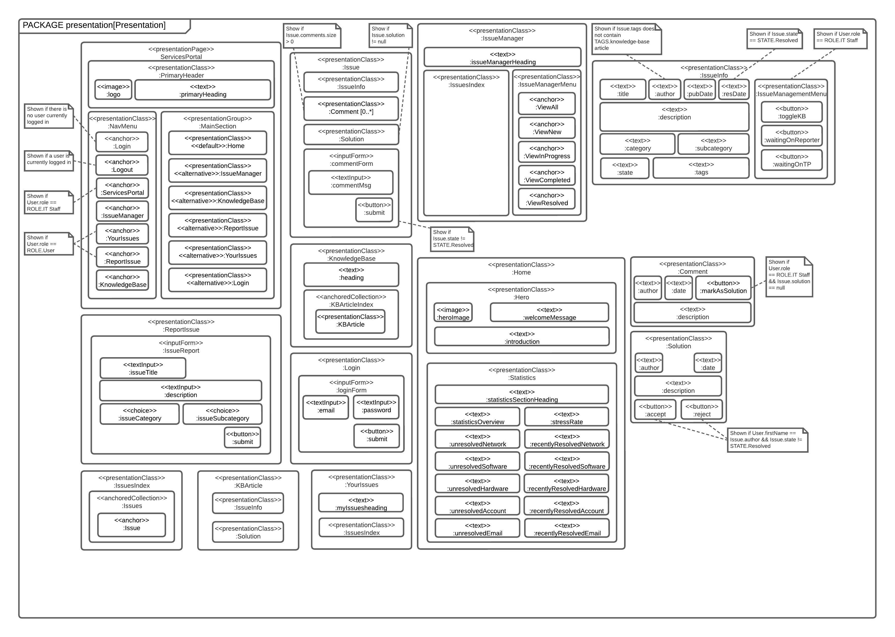
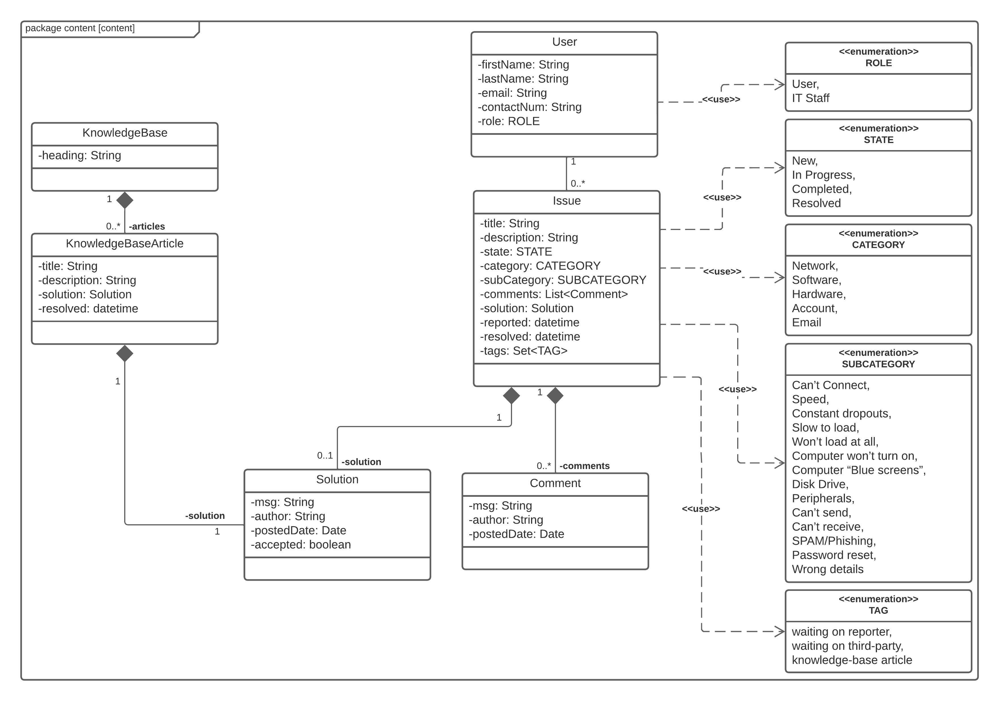
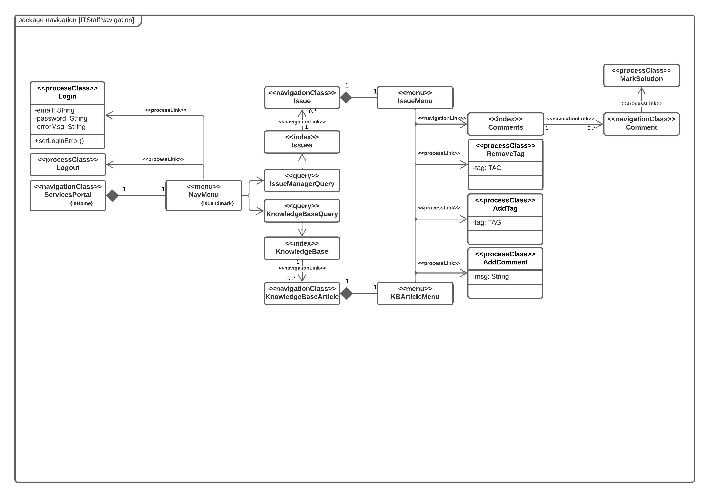
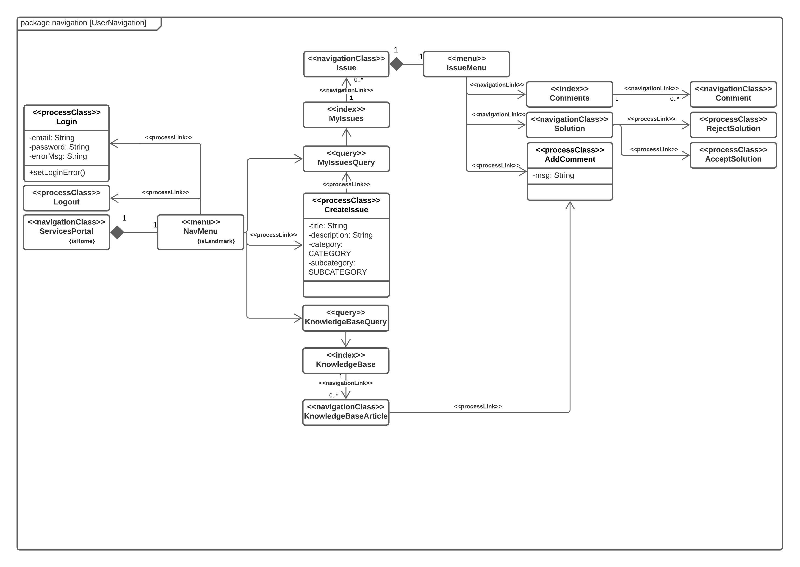

# IT Services Portal

The IT Services Portal is a web application for managing and reporting IT services-related issues and incidents. It was created as part of a course assignment at the University of Newcastle, with the goal of improving the efficiency of the IT staff by providing a knowledge-base for users to browse before submitting an issue. The application was created using Spring Framework and Java, and follows the MVC (Model-View-Controller) architecture.

## Features

* Categories and sub-categories for issues
* Knowlege-base that IT staff can add solved issues to
* IT staff can mark a comment as a potential solution to be reviewed by the issue' author.
* Issues tracker for assisting IT staff with tracking and managing issues.
* c
* The homepage of the application includes a statistics section that shows the total unsolved incidents in each category, the total resolved incidents within the last 7 days in each category, and the stress rate.

## Use Cases

The IT Services Portal has different use cases depending on whether the authenticated user has the 'IT Staff' role or the 'Client' role. The following are the use cases for each role:

### IT Staff

* Mark comments as suggested solutions
* Add or remove issues to the knowledge base
* View all issues
* Filter issues by status
* Tag issues

### Client

* Create issue reports
* View self-reported issues
* Review suggested solutions

### Both

* Comment on issues
* View the knowledge base
* Log in and out

## Design

### Presentation



### Content 



### Navigation

#### IT Staff

The following UWE diagram shows the different pages and features available to IT Staff members, as well as the actions they can perform on each page:



This diagram shows that IT Staff members can view a list of all issues, filter issues by status, and tag issues. They can also mark comments as suggested solutions, and add or remove issues to the knowledge base.

#### Client

The following UWE diagram shows the different pages and features available to Clients, as well as the actions they can perform on each page:



This diagram shows that Clients can create issue reports and view their own self-reported issues. They can also review suggested solutions and comment on issues.

## Technologies Used

* [Spring Framework](https://spring.io/projects/spring-framework)
* [Spring Boot](https://spring.io/projects/spring-boot)
* [Spring Security](https://spring.io/projects/spring-security)
* [Spring Data](https://spring.io/projects/spring-data)
* [Apache Tomcat](https://tomcat.apache.org/) for hosting the application.
* [Azure SQL Server](https://azure.microsoft.com/en-au/services/sql-database/campaign/) / [Microsoft SQL Server](https://www.microsoft.com/en-au/sql-server/sql-server-2019) for hosting the database on the cloud or locally, respectively.
* [Spring Session](https://spring.io/projects/spring-session)
* [Jakarta Server Pages](https://projects.eclipse.org/projects/ee4j.jsp) (JSPs)
* [Chart.js](https://www.chartjs.org/) for creating a visualisation of the performance statistics.

## Dependencies

To build and run the application, you will need the following dependencies:

* Apache Maven
* Java 11
* Local or cloud hosted Microsoft SQL (or T-SQL) database

## Setup

The IT Services Portal uses Spring Security to manage authentication, and data is stored on a SQL database accessed using JDBC. A SQL script for setting up the database is provided in the repository.

To setup a database connection, you will need to set the driver name, database URL, and the username and password for connecting the database in [`DatasourceConfig`](./src/main/java/com/spacejaam/itservicesportal/configs/DatasourceConfig.java). The application does not provide the ability for users to create accounts, and so, accounts must be manually added to the database.

1. Import the required packages by adding the following code at the top of [`LoginController`](./src/main/java/com/spacejaam/itservicesportal/controller/LoginController.java).

    ```java
    import org.springframework.security.crypto.password.PasswordEncoder;

    import com.spacejaam.itservicesportal.data.ClientDAO;
    import com.spacejaam.itservicesportal.enums.Role;
    import com.spacejaam.itservicesportal.models.Client;
    ```

2. Add the following code at the top of the [`LoginController`](./src/main/java/com/spacejaam/itservicesportal/controller/LoginController.java#L11) class.

    ```java
    private final ClientDAO clientDAO;
    private final PasswordEncoder encoder;

    @Autowired
    LoginController(ClientDAO clientDAO, PasswordEncoder encoder) {
        this.clientDAO = clientDAO;
        this.encoder = encoder;
    }
    ```

3. Add the following code to the `getLoginView()` method in the [`LoginController`](./src/main/java/com/spacejaam/itservicesportal/controller/LoginController.java#L11) class.

    ```java
    clientDAO.insertClient(new Client(
            "firstName",
            "lastName",
            "email",
            encoder.encode("password"),
            "phone",
            Role.ITSTAFF,
            true,
            true,
            true,
            true
    ));
    ```

After following these steps, each time the `getLoginView()` method is called, a new account is added to the database and can be used to sign into the application. The details of the account in the `insertClient()` method can be modified to change their first name, last name, email, password, phone number, and role. The role can be one of three options, `Role.ITSTAFF`, `Role.User`, or `Role.DEV`. The `DEV` role provides the account with full-access to all features of the IT services portal.

The following table provides example data that can be used for creating accounts:

| Username                           | Password              | Role       |
|------------------------------------|-----------------------|------------|
| `nzinga_houghus5j@wit.vs`          | `UkyDJvlLRqcLL1FLdV7` | `IT Staff` |
| `aamil_delcastillorp@volumes.zn`   | `d3Eu5SE2DIZ89`       | `User`     |
| `binyomin_ruckmanh1tj@richards.ug` | `EosoGD9MoHtRSuRoNHb` | `User`     |
| `marena_davidsontmsu@company.mpd`  | `3mCE7UjWt9F`         | `IT Staff` |

## Build

To build the project, you will need to run the following command inside the project directory:

```ps
mvn clean install
```

## Run

To run the application locally using Apache Tomcat (see [Tomcat Setup](https://tomcat.apache.org/tomcat-8.5-doc/setup.html)), follow these steps:

1. Move the project file into the `<tomcat-installation-directory>/webapps` directory
2. Run `<tomcat-installation-directory>/bin/startup.bat`

## Credits

Alex Budden ([Buddostars](https://github.com/Buddostars))

Aiden Brown ([Aiden-Brown](https://github.com/Aiden-Brown))

## License

Licensed under the MIT License. See [LICENSE](./LICENSE) for more information.
